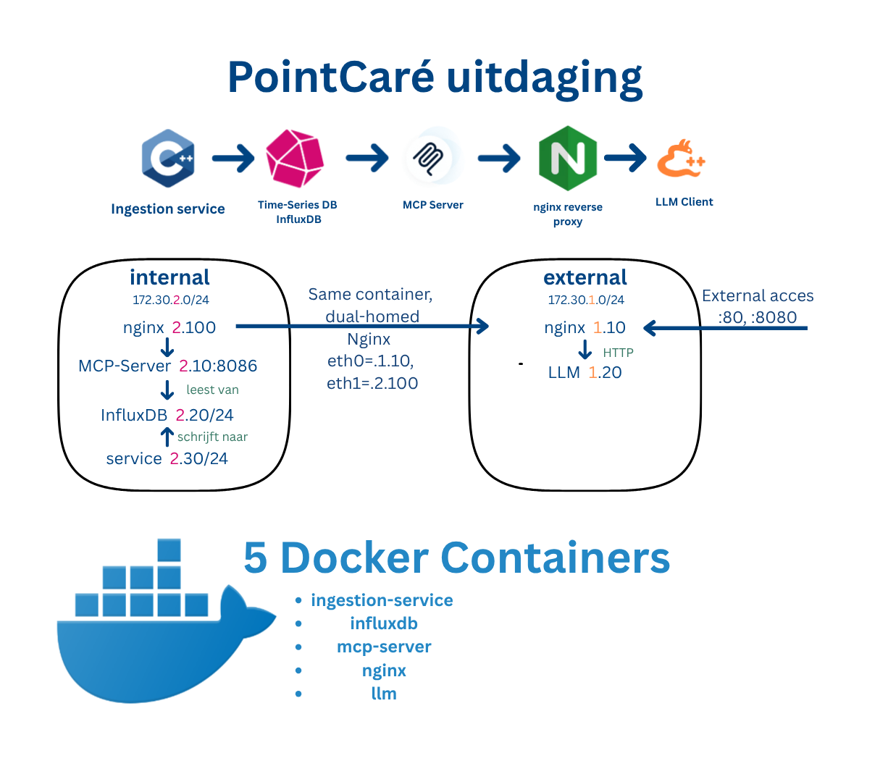

# PointCare Technical Challenge 


## 1. System Overview and Architecture

**Network Segmentation:**



### System Components

### 1. Data Ingestion Service (C++)
- Simulates 5 medical sensors: temperature, heart rate, blood pressure, SpO2, respiration rate
- Posts readings to InfluxDB every 5 seconds via HTTP API
- Configurable via environment variables (host, interval, credentials)

### 2. Time-Series Database (InfluxDB)
- Stores  fields `timestamp`, `sensor_id`, `metric_name`, `value`
- InfluxDB 2.7 with Flux query language
- Persistent volumes for data and config
- Internal access only (172.25.2.20:8086), exposed on :8087 for testing/debugging

### 3. MCP Server (Python FastAPI)
- **Aggregation queries:** mean, max, min, count over time windows (1m, 5m, 1h, 24h)
- **Filtering queries:** threshold-based sensor readings (above/below/equal)
- Returns structured JSON for LLM consumption
- Health check endpoint at `/health`

### 4. Reverse Proxy (Nginx)
- Routes external requests to MCP server
- Single point of entry for API access
- Lightweight Alpine-based deployment

### 5. LLM Integration (Llama-3.2-1B)
- Meta's Llama-3.2-1B-Instruct via llama.cpp server
- Queries MCP server dynamically for real-time data

---

## 2. Network and Subnet Design Rationale

### Prerequisites
- Docker & Docker Compose
- 2GB free disk space (for LLM model)
- Ports 80, 8080, 8087 available

### Installation

1. Clone repository:
```bash
git clone <repository-url>
cd Assignment-PointCare
```

2. Download LLM model (one-time, ~807MB):
```powershell
# Windows PowerShell
.\llm\download-model.ps1

# Or manually:
# Visit https://huggingface.co/lmstudio-community/Llama-3.2-1B-Instruct-GGUF
# Download llama-3.2-1b-instruct-q4_k_m.gguf to ./llm/models/
```

3. Start all services:
```bash
docker-compose up -d
```

4. Wait ~30 seconds for LLM model to load, then verify:
```bash
docker ps  # All containers should show "healthy" or "Up"
```

---

## 4. Example Queries and Expected LLM Outputs

### Testing the System

**Health checks:**
```bash
curl http://localhost/health
# Expected: {"status": "healthy"}

curl http://localhost:8080/health
# Expected: 200 OK
```

**Direct MCP queries:**
```bash
# Get average temperature over last 5 minutes
curl -X POST http://localhost/api/aggregate \
  -H "Content-Type: application/json" \
  -d '{"metric":"temperature","function":"mean","time_range":"5m"}'
# Expected: {"value": 37.2, "status": "success"}

# Find sensors with heart_rate > 90
curl -X POST http://localhost/api/filter \
  -H "Content-Type: application/json" \
  -d '{"metric":"heart_rate","operator":"greater","threshold":90,"time_range":"1h"}'
# Expected: {"count": 12, "status": "success", "exceeding_readings": [...]}
```

**LLM Integration Demo:**
```bash
# Wait for all services to be ready (LLM model takes ~30-60 seconds to load)
docker-compose logs -f llm  # Watch for "Model loaded successfully"

# Run the LLM client example
python llm/client_example.py
```

Expected output demonstrates:
- LLM function calling to query MCP server
- Two query types: aggregation and filtering
- Dynamic data retrieval (proves non-hardcoded responses)
- Real-time sensor data analysis with timestamps

Example 1 -> Bad vitals:
```
----------------------------------------------------------------------
User Query: Analyze the patient's vital signs over the 5 minutes. 
Provide a brief clinical assessment in maximum 3 sentences.

Gathering vital signs data via MCP...
  temperature: 39.98
  heart_rate: 108.85
  blood_pressure: 124.92
  spo2: 82.82
  respiration_rate: 22.12

LLM Clinical Reasoning (using JSON context)...
Sending clinical data to LLM for analysis... Done!

 **Clinical Assessment:**

The patient's vital signs indicate hypothermia, tachycardia, hypotension, and respiratory
 distress. The patient's SpO2 level is critically low at 82.82%, indicating severe 
 hypoxemia. The patient's heart rate is elevated at 108.85 bpm, and blood pressure is 
 significantly decreased at 124.92 mmHg, further supporting the notion of hypotension. 
 Respiration rate is also elevated at 22.12 breaths/min, suggesting respiratory compromise.
 These findings suggest that the patient is in severe distress, likely requiring immediate 
 attention and stabilization.

======================================================================
```

Example 2 -> normal vitals:
```
----------------------------------------------------------------------
User Query: Analyze the patient's vital signs over the 5 minutes. 
Provide a brief clinical assessment in maximum 3 sentences.

Gathering vital signs data via MCP...
  temperature: 37.23
  heart_rate: 81.08
  blood_pressure: 124.27
  spo2: 97.65
  respiration_rate: 16.11

LLM Clinical Reasoning (using JSON context)...
Sending clinical data to LLM for analysis... Done!

 Based on the provided vital signs data, here is a concise clinical assessment:

The patient's vital signs indicate a stable temperature (37.23°C), normal heart rate 
(81.08 beats per minute), and blood pressure within a relatively normal range 
(124.27/78.45 mmHg). The patient's oxygen saturation (spo2) is within a normal range 
(97.65%), and their respiratory rate is within a normal range (16.11 breaths per minute).
 These findings suggest that the patient is experiencing mild to moderate respiratory 
 distress, but the patient's overall clinical status appears to be stable.

======================================================================
```

---

## 5. Assumptions, Limitations, and Trade-offs

**Assumptions:**
- Single-node deployment 
- Sensor data is simulated (random values within physiological ranges)
- Development environment

**Limitations:**
- No authentication/authorization (InfluxDB token hardcoded)
- No HTTPS/TLS (would require certificate management)
- No data retention policies (InfluxDB will grow indefinitely)
- No horizontal scaling (single instance per service)
- CPU-only LLM inference (GPU would be 10x faster)

**Trade-offs:**
- **5-second ingestion interval:** Fast enough to show real-time, slow enough to avoid data overload
- **Q4 quantization:** 4-bit quantization reduces accuracy slightly but enables CPU inference
- **No caching:** Every LLM query hits database for fresh data 
- **Simple error handling:** Retries not implemented

### Design Decisions and Rationale

**Why InfluxDB?**
- Native time-series optimization (compression, downsampling, retention policies)
- Flux query language designed for sensor data aggregation
- Better performance than general-purpose databases for timestamp-indexed data
- **vs TimescaleDB:** InfluxDB has simpler setup, no PostgreSQL overhead

### Why Llama-3.2-1B?
- Small enough for CPU-only inference (~2-3 sec response time)
- Excellent function calling support (critical for MCP integration)
- Meta's latest model (Sept 2024) with good instruction following
- **vs larger models:** 7B+ models too slow on CPU, medical-specific models unnecessary for JSON interpretation

### Why Python for MCP server?
- FastAPI provides async performance with minimal code
- InfluxDB Python client is well-maintained
- Faster development than Node.js for data pipeline tasks
- **vs Node.js:** Python has better data science ecosystem for future ML features

### Why Nginx?
- Battle-tested, minimal resource footprint (Alpine image)
- Simple config for reverse proxy use case
- **vs Traefik:** Nginx is simpler for static routing, no need for dynamic service discovery

### Why C++ for ingestion?
- Assignment requirement, demonstrates low-level systems skills
- Realistic for embedded sensor devices (resource-constrained environments)
- libcurl provides robust HTTP client functionality

## Assumptions & Limitations

**Assumptions:**
- Single-node deployment (no distributed systems complexity)
- Sensor data is simulated (random values within physiological ranges)
- LLM has internet access during model download (huggingface.co)
- Development environment (not production-hardened)

**Limitations:**
- No authentication/authorization (InfluxDB token is hardcoded for PoC)
- No HTTPS/TLS (would require certificate management)
- No data retention policies (InfluxDB will grow indefinitely)
- No horizontal scaling (single instance per service)
- CPU-only LLM inference (GPU would be 10x faster)

**Trade-offs:**
- **5-second ingestion interval:** Fast enough to show real-time, slow enough to avoid data overload
- **Q4 quantization:** 4-bit quantization reduces accuracy slightly but enables CPU inference
- **No caching:** Every LLM query hits database for fresh data (proves non-hardcoded responses)
- **Simple error handling:** Retries not implemented (would add complexity)


## Troubleshooting

**Container won't start:**
```bash
docker-compose logs <service-name>  # Check error messages
docker-compose down -v              # Clean slate restart
docker-compose up -d
```

**LLM server shows "Loading model" errors:**
- Wait 30-60 seconds for model to load into memory
- Check `docker logs llm-pointcare` for progress
- Verify model file exists: `ls -lh llm/models/`

**No data in InfluxDB:**
- Check ingestion service: `docker logs ingestion-service-pointcare`
- Verify InfluxDB is accessible: `curl http://localhost:8087/health`
- Check credentials match in docker-compose.yaml

**MCP server returns empty results:**
- Ensure ingestion has run for >5 minutes (data accumulation)
- Check time_range parameter (too short = no data)
- Verify InfluxDB has data: `docker exec influxdb-pointcare influx query 'from(bucket:"sensors") |> range(start:-1h)'`

---
